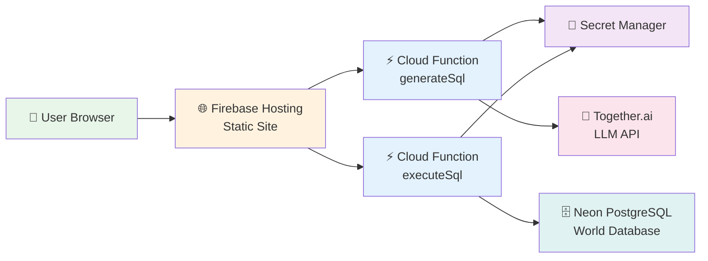
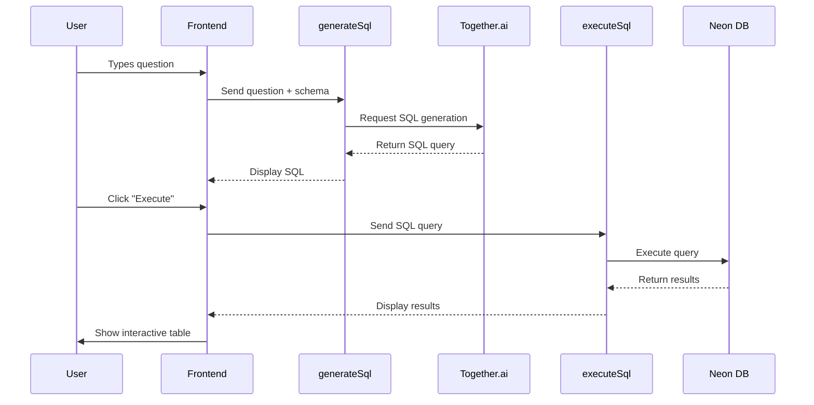

# 🔮 Natural Language to SQL Query Generator

> Ask questions in plain English, get SQL queries instantly!

[](https://nl2sql-query.web.app)
[](https://opensource.org/licenses/MIT)

A privacy-focused web app that converts your natural language questions into SQL queries using AI. Built with modern web technologies and deployed entirely on free-tier services.

**🌐 [Try it live!](https://nl2sql-query.web.app)**

---

## ✨ What It Does

Ever wanted to query a database but weren't sure how to write the SQL? This app has you covered! Just type your question in plain English, and our AI will:

1. 🧠 Understand what you're asking
2. 📝 Generate the corresponding SQL query
3. ⚡ Execute it against a real PostgreSQL database
4. 📊 Show you the results in a beautiful, sortable table

**Example questions:**
- "Show me the top 10 cities by population"
- "Which countries are in Europe?"
- "What languages are spoken in Colombia?"

---

## 🔒 Privacy & Security

We take your privacy seriously:

- ✅ **No data collection** - No data is stored about your questions or results
- ✅ **Server-side processing** - All queries run securely in the cloud
- ✅ **Zero tracking** - No analytics, no cookies, no user monitoring
- ✅ **Secure secrets** - API keys stored in Google Cloud Secret Manager
- ✅ **Read-only queries** - Only SELECT statements allowed (no data modifications)

---

## 🚀 Features

- 💬 **Natural Language Interface** - Ask questions like you're talking to a person
- 🎨 **Syntax Highlighting** - SQL queries displayed with beautiful formatting
- ✏️ **Edit & Execute** - Modify generated queries before running them
- 📋 **Query History** - Keep track of your previous queries
- 📊 **Interactive Results** - Sort, paginate, and export results to CSV
- 🗺️ **Schema Visualization** - Explore the database structure
- 🌙 **Dark Mode** - Easy on the eyes, day or night
- 📱 **Responsive Design** - Works great on desktop and mobile

---

## 🏗️ Technical Architecture



### Tech Stack

**Frontend:**
- Next.js 14 (Static Export)
- Chakra UI (Component Library)
- React 18
- Syntax Highlighter

**Backend:**
- Firebase Cloud Functions (Gen 2)
- Node.js 20
- PostgreSQL Client

**Infrastructure:**
- Firebase Hosting (Static files)
- Google Cloud Secret Manager (API keys)
- Neon PostgreSQL (Database)
- Together.ai (LLM API)

**Server Region:** Europe

---

## 🎯 How It Works

Here's the complete workflow when you ask a question:



1. **You ask a question** in plain English
2. **Frontend sends** your question to the `generateSql` Cloud Function
3. **AI processes** the question with the database schema context
4. **SQL query generated** and displayed with syntax highlighting
5. **You review** (and optionally edit) the query
6. **Click execute** to run the query
7. **Backend runs** the SQL against Neon PostgreSQL
8. **Results appear** in a beautiful, interactive table

---

## 🗄️ Database

This app queries the ["World" sample database](https://www.postgresql.org/ftp/projects/pgFoundry/dbsamples/world/world-1.0/) from PostgreSQL, which contains:

- **`city`** - Cities with population data
- **`country`** - Country information (area, population, continent, currency, etc.)
- **`countrylanguage`** - Languages spoken in each country

---

## 🛠️ Local Development

Want to run this on your machine? Here's how:

### Prerequisites

- Node.js 20 or higher
- Firebase CLI: `npm install -g firebase-tools`
- API keys:
  - [Together.ai](https://www.together.ai/) account (for LLM)
  - [Neon](https://neon.tech/) PostgreSQL database

### Setup

```bash
# Clone the repository
git clone https://github.com/fdemirciler/natural_language_to_sql_query_generator.git
cd natural_language_to_sql_query_generator

# Install dependencies
npm install
cd functions && npm install && cd ..

# Setup environment variables
cp .env.example .env.local
cp functions/.env.example functions/.env.local

# Edit .env.local files with your actual API keys:
# - TOGETHER_API_KEY=your_together_ai_key
# - NEON_DATABASE_URL=your_neon_connection_string

# Run the development server
npm run dev
```

Visit [http://localhost:3000](http://localhost:3000) and start querying! 🎉

---

## 📁 Project Structure

```
nl2sql_query_generator/
├── functions/              # Firebase Cloud Functions (backend)
│   ├── index.js           # generateSql & executeSql functions
│   └── package.json       # Backend dependencies
├── src/
│   ├── components/        # React UI components
│   │   ├── ChatInterface.js
│   │   ├── ResultsTable.js
│   │   ├── SqlDisplay.js
│   │   ├── SchemaVisualizer.js
│   │   ├── HistoryPanel.js
│   │   └── HistoryItem.js
│   ├── pages/
│   │   ├── _app.js        # Next.js app wrapper
│   │   └── index.js       # Main page
│   ├── utils/
│   │   └── schema.js      # Schema utilities
│   └── theme.js           # Chakra UI theme
├── public/
│   └── world_cities_schema.json  # Database schema
├── firebase.json          # Firebase configuration
├── .firebaserc            # Firebase project settings
├── next.config.js         # Next.js configuration
└── package.json           # Frontend dependencies
```

---

## 🚢 Deployment

This app is deployed on Firebase and runs entirely on **free tier** services:

- **Firebase Hosting** - Static frontend files
- **Firebase Cloud Functions** - Backend API endpoints
- **Google Cloud Secret Manager** - API key storage
- **Neon PostgreSQL** - Database (free tier)
- **Together.ai** - LLM API (free tier)

**Total monthly cost: $0** 💰

### Deploy Your Own

```bash
# Build the frontend
npm run build

# Deploy to Firebase
firebase deploy
```

Make sure to configure your secrets in Google Cloud Secret Manager before deploying.

---

## 🤝 Contributing

Contributions are welcome! Feel free to:

- 🐛 Report bugs
- 💡 Suggest new features
- 🔧 Submit pull requests
- 📖 Improve documentation

---

## 📄 License

MIT License - feel free to use this project however you'd like!

---

## 👨‍💻 Author

**Fatih Demirciler**

- GitHub: [@fdemirciler](https://github.com/fdemirciler)
- Live Demo: [nl2sql-query.web.app](https://nl2sql-query.web.app)

---


